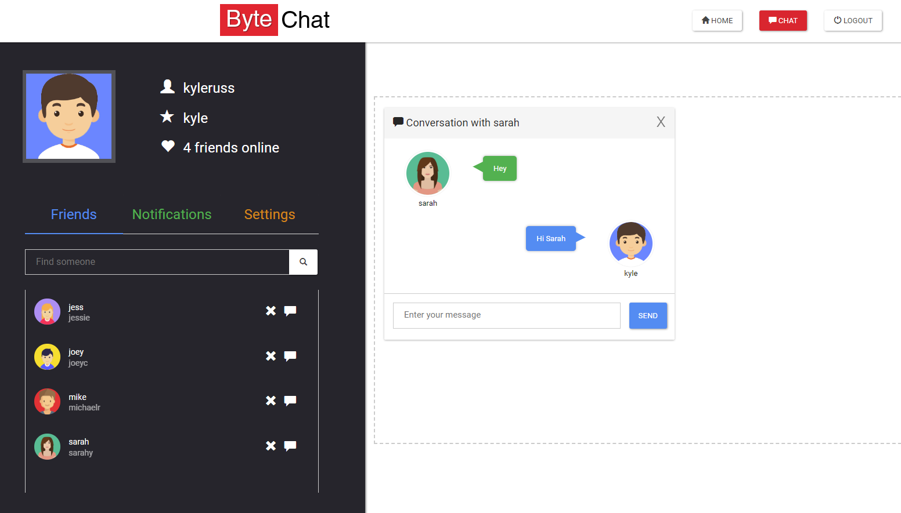
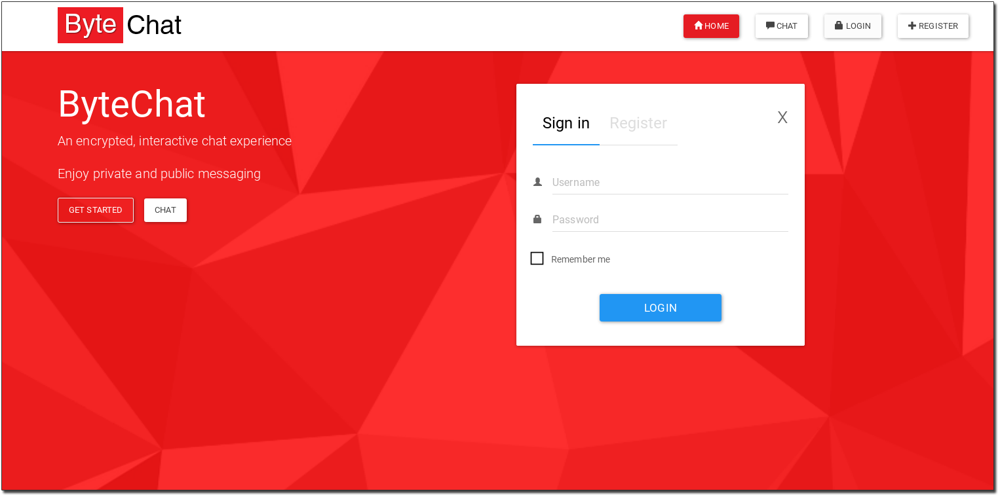
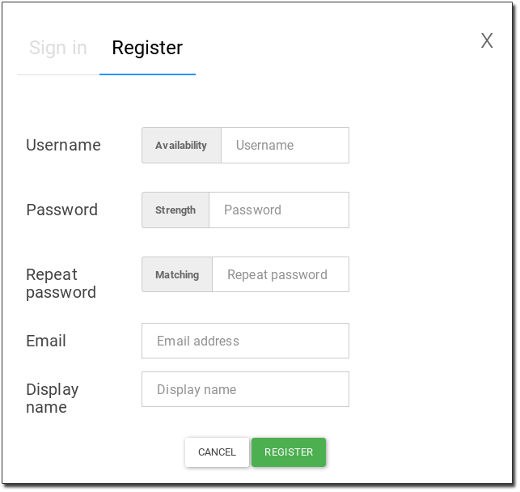
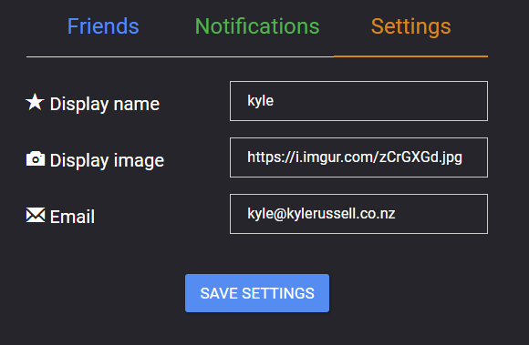
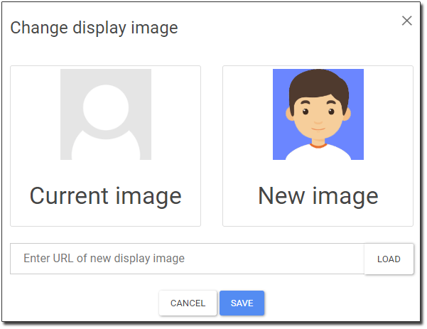
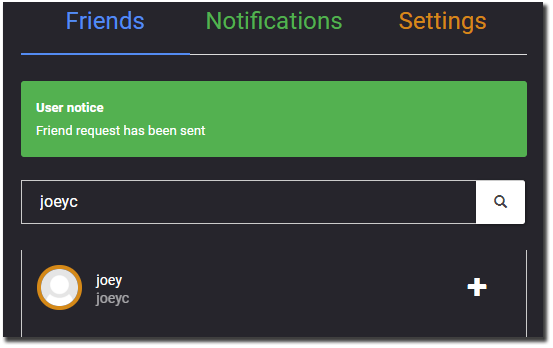
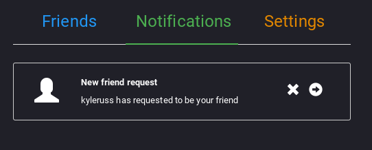
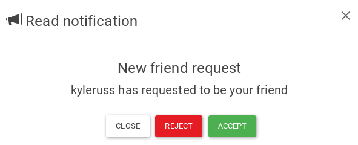
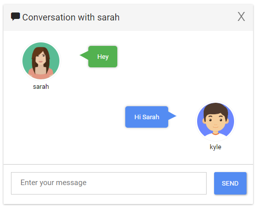

# ByteChat



ByteChat is an encrypted messaging web application developed with Socket.IO and Laravel  
The application provides an instant messaging and social-networking service for users  
ByteChat ensures communication is secure such that all messages are encrypted with AES where  
several crypto libraries [aes-lib-js](https://github.com/kyleruss/aes-lib-js) & [SafeExchange](https://github.com/kyleruss/safe-exchange) were written for this project  
Addtionally, the application was supported by recent [research work](https://github.com/kyleruss/aes-lib-js/blob/master/AESAppliedInWebTechnology.pdf)


## Features
### User Sign-in



### Account Registration



### Change Settings



### Change Display Picture



### Add Friends
First search for your friend then add them



New friend requests will show up in your Notifications



You can choose to accept or decline a friend request



### Chatting
You can chat with any of your online friends  
Users can be chatting with multiple friends simultaneously




## Getting started
### Prerequisites
- Laravel 4.1
- NodeJS
- [SafeExchange](https://github.com/kyleruss/safe-exchange)
- [aes-lib-js](https://github.com/kyleruss/aes-lib-js)
- MySQL 5.6+
- Apache

### Installation
- Clone the byte-chat repository
```
git clone https://github.com/kyleruss/byte-chat.git
```

- Start your MySQL server and reate the ByteChat database 
```
sudo service mysql start
mysql -u root -p
CREATE DATABASE MySQL;
exit
```

- Migrate the tables
```
php artisan migrate
```

- Start your apache and the node server in `nodeserver` directory
```
sudo service apache2 start
node nServer
```

- Connect to the server at `http://localhost/ByteChat/public`
You can change the connection parameters in `public/javascript/main.js`  
The node listening port can be changed in `nodeserver/nServer.js`

# License
ByteChat is available under the MIT License  
See [LICENSE](LICENSE) for more details
